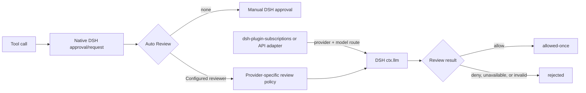

# Auto Review

`dsh-plugin-auto-review` lets DeepSeek Harness use a model to answer native
tool approval requests. It supplies the review policy and approval integration,
but does not bundle models, accounts, or credentials.

The underlying Codex or Grok model comes from a DSH LLM adapter. A provider
plugin such as `dsh-plugin-subscriptions` can expose `codex/codex-auto-review`
or `grok/grok-4-fast-reasoning`; an API adapter can expose a compatible route
instead. The adapter owns authentication and transport, while Auto Review calls
its registered route through `ctx.llm.stream()`.

## How it works



### Runtime example

Codex Auto Review approves a sandboxed shell operation in the parent session:


The selected reviewer is inherited by a delegated subagent and handles its
approval without opening an unattended human prompt:


## Quick start

The plugin registers Codex Guardian and Grok escalation policies and starts in
manual mode. Once the corresponding DSH LLM route is available, select the
reviewer in Web or set a default:

```yaml
autoReview: codex
```

Web exposes both a global selection in Settings and a per-session selection
beside the conversation input. Only currently usable routes are offered; an
already selected route that disappears remains visible as unavailable and
fails closed. Select `none` to use native manual approval.

| Reviewer | Policy | Default DSH route |
| --- | --- | --- |
| Codex | Codex Guardian | `codex/codex-auto-review` |
| Grok | Grok escalation review | `grok/grok-4-fast-reasoning` |

## Custom routes

`policy` selects the review logic. `provider` and `model` select the DSH LLM
route that supplies the model:

```yaml
autoReview: api-guardian
reviewers:
  - policy: codex
    reviewerId: api-guardian
    label: Company API Guardian
    provider: openai-api
    model: gpt-5
    reasoningEffort: low
```

`reviewerId` must be unique. Entries without `policy` retain Codex Guardian
behavior. The global selection is stored at
`plugins/auto-review/auto-review.json`; session selections are in-memory and
inherited by child sessions.

## Safety

The model runs only after the exact tool call reaches a real
`approval/request`; ordinary allowed calls remain model-free. With a reviewer
selected, denial, unavailability, timeout, interruption, or malformed output is
rejected. With `none`, DSH keeps its native manual flow. Delegated subagents do
not open unattended human prompts: they may inherit a machine reviewer, but
manual approval remains disabled for delegation.

Auto Review does not bypass DSH permissions. If the sandbox denies a Bash call,
the plugin may retry that exact call with the next sandbox mode, but the retry
passes through the same approval boundary. Tool actions are matched by call id
and name and consumed once. Review transcripts are bounded and exclude injected
plugin context from user authorization anchors.

## Compatibility and development

The package targets the DSH `0.1.2-alpha.3` service contracts and browser client
slots. From a checkout with the matching toolchain:

```sh
npm run build
npm test
```
