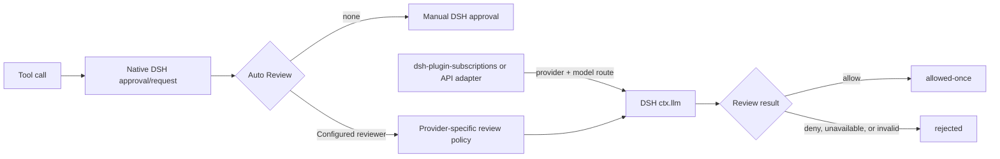

# Auto Review

`dsh-plugin-auto-review` reproduces provider-specific approval-review behavior
inside DeepSeek Harness. Each policy implements the review logic of a supported
provider—for the first release, Codex Guardian and Grok escalation—while the
model itself can be supplied through any compatible DSH LLM adapter.

The underlying Codex or Grok model comes from a DSH LLM adapter. A provider
plugin such as `dsh-plugin-subscriptions` can expose `codex/codex-auto-review`
or `grok/grok-4-fast-reasoning`; an API adapter can expose a compatible route
instead. The adapter owns authentication and transport, while Auto Review calls
its registered route through `ctx.llm.stream()`.

## Install

The package is published on [npm](https://www.npmjs.com/package/dsh-plugin-auto-review)
as `dsh-plugin-auto-review`. Install it into each DSH profile where automatic
review should be available:

```sh
dsh plugin --profile web add dsh-plugin-auto-review
dsh plugin --profile headless add dsh-plugin-auto-review
```

Restart the corresponding DSH process after installation so the profile loads
the plugin. To update an npm installation later:

```sh
dsh plugin --profile web update --latest dsh-plugin-auto-review
dsh plugin --profile headless update --latest dsh-plugin-auto-review
```

The same release is also mirrored to
[GitHub Packages](https://github.com/users/delef/packages/npm/package/dsh-plugin-auto-review)
as `@delef/dsh-plugin-auto-review`. That distribution requires GitHub Packages
authentication; npm is the recommended installation source.

## How it works


```mermaid
flowchart LR
    A[Tool call] --> B[Native DSH approval/request]
    B --> C{Auto Review}
    C -->|none| D[Manual DSH approval]
    C -->|Configured reviewer| E[Provider-specific review policy]
    F[dsh-plugin-subscriptions or API adapter] -->|provider + model route| G[DSH ctx.llm]
    E --> G
    G --> H{Review result}
    H -->|allow| I[allowed-once]
    H -->|deny, unavailable, or invalid| J[rejected]
```

### Runtime example

Codex Auto Review approves a sandboxed shell operation in the parent session:


The selected reviewer is inherited by a delegated subagent and handles its
approval without opening an unattended human prompt:


## Quick start

The plugin registers Codex Guardian and Grok escalation policies and starts in
manual mode. Once the corresponding DSH LLM route is available, select the
reviewer in Web or set a default:

```yaml
autoReview: codex
```

Web exposes both a global selection in Settings and a per-session selection
beside the conversation input. Only currently usable routes are offered; an
already selected route that disappears remains visible as unavailable and
fails closed. Select `none` to use native manual approval.

| Reviewer | Policy | Default DSH route |
| --- | --- | --- |
| Codex | Codex Guardian | `codex/codex-auto-review` |
| Grok | Grok escalation review | `grok/grok-4-fast-reasoning` |

## Custom routes

`policy` selects the review logic. `provider` and `model` select the DSH LLM
route that supplies the model:

```yaml
autoReview: api-guardian
reviewers:
  - policy: codex
    reviewerId: api-guardian
    label: Company API Guardian
    provider: openai-api
    model: gpt-5
    reasoningEffort: low
```

`reviewerId` must be unique. Entries without `policy` retain Codex Guardian
behavior. The global selection is stored at
`plugins/auto-review/auto-review.json`; session selections are in-memory and
inherited by child sessions.

## Safety

The model runs only after the exact tool call reaches a real
`approval/request`; ordinary allowed calls remain model-free. With a reviewer
selected, denial, unavailability, timeout, interruption, or malformed output is
rejected. With `none`, DSH keeps its native manual flow. Delegated subagents do
not open unattended human prompts: they may inherit a machine reviewer, but
manual approval remains disabled for delegation.

Auto Review does not bypass DSH permissions. If the sandbox denies a Bash call,
the plugin may retry that exact call with the next sandbox mode, but the retry
passes through the same approval boundary. Tool actions are matched by call id
and name and consumed once. Review transcripts are bounded and exclude injected
plugin context from user authorization anchors.

## Compatibility and development

Requires Node.js `>=22.13.0`. The declared DSH target is `0.1.2-alpha.3`,
matching the pinned development service contracts and browser client slots.
Other DSH releases have not been validated; no exact-release runtime acceptance
is claimed by this range declaration.

Git installs use the committed `lib/` output and run no `preinstall`, `install`,
`postinstall`, or `prepare` scripts. Maintainers build before committing source
changes. `prepublishOnly` builds and tests only when publishing to npm.
The lockfile pins the development toolchain; legacy peer resolution prevents npm
from mixing newer transitive DSH peers into the pinned alpha service contracts.
From a checkout:

```sh
npm ci --ignore-scripts --legacy-peer-deps
npm run build
npm test
git diff --exit-code -- lib
```

## Permissions and external services

This is an approval-policy plugin with elevated capabilities, not a low-risk
utility. DSH STORE may require `user-reviewed` status or keep installation blocked.

- **Files:** reads and writes the reviewer selection under the DSH home at
  `plugins/auto-review/auto-review.json`, using a temporary file and atomic rename.
  Session selections remain in memory. It does not read credential stores.
- **Model traffic:** sends bounded conversation context and the proposed tool
  action through the configured DSH LLM route. That context can contain private
  project data or credentials already present in the conversation/tool arguments.
  The selected adapter owns authentication, endpoints, network transport, and billing;
  Auto Review itself has no API key configuration or direct HTTP client.
- **Approval and commands:** handles native approval requests and can request a
  retry of the same Bash call with the next sandbox mode. DSH executes the tool
  through its approval boundary; this plugin does not spawn a shell itself.
- **Dependencies:** official DSH services are peer dependencies supplied by the
  host, including LLM, Tools, User Approval, Home Paths, and Web client services.
  A separately configured LLM adapter is required for machine review. No adapter
  or credentials are installed by this package.
- **Failure bounds:** machine review rejects denied, unavailable, interrupted,
  timed-out, or malformed results. `none` retains manual approval. A model decision
  is not a security guarantee; review sensitive actions and provider data handling
  before enabling automatic approval.

MIT licensing applies to the source and shipped package; `LICENSE` is included
in the distribution. Packaging and validation evidence is in
[docs/distribution-validation.md](docs/distribution-validation.md).
